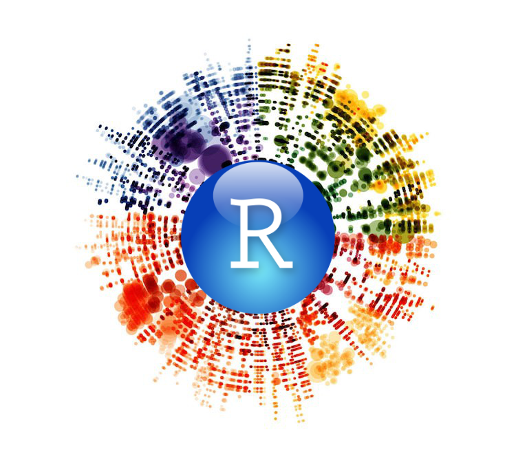

# Welcome!

Hello and welcome to the wonderful world of **R and RStudio**, ****brought to you by the Univeristy of Melbourne! 

We offer a range of free workshops and community events \([found here!](https://gateway.research.unimelb.edu.au/events/researcher-connect#digital-skills-training)\) aimed at teaching you the digital tools and skills needed to get the most out of your research. Our focus is on researchers teaching researchers with many of our trainers currently performing research in masters or doctoral degrees. Subscribe to our [mailing list](mailto:mdap-info@unimelb.edu.au?subject=MDAP%20Newsletter%3A%20Subscribe&body=Hi%20MDAP%2C%0A%0APlease%2C%20add%20me%20to%20the%20mailing%20list.%0A%0A) to hear all about our upcoming events: conferences, workshops, meetups and more! 

Due to the current public health crisis surronding the SARS-coV-2 virus, we have placed a moratorium on our face to face teaching sessions. Instead, through this page you can find self-paced, online versions of our trainings to help get you off the ground and started at analyising your data using R and RStudio!

