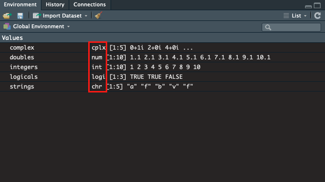

# Data Types

When we were making some vectors in the last lesson, you might have noticed a word appear in the environment panel between the name of the vector, and the values it contained**:** 



These are the **types** of data that make up the vector, and determine the properties of the data, and what kind of manipulations you can perform on it. 

  
In R, _all_ data objects have a data type. In this lesson we are going to have look at 5 important data types, which from most simple to most complex are:

* Logicals `logi`
* Integers `int`
* Doubles `num`
* Complex Numbers `cplx`
* and Strings `chr`

Let's go into a little detail about these different data types.

## Logicals

The simplest of data types you can encounter in R are the **logicals**. Logical type data can take one of two values, either `TRUE` or `FALSE.`  
We have already encountered logicals in the last chapter, when performing comparisons.

```r
> 5 >= 3
[1] TRUE

> c(1, 2, 3, 4, 5) >= c(5, 4, 3, 2, 1)
[1] FALSE FALSE TRUE TRUE TRUE
```

If you're feeling lazy, logicals can also be defined just by using `T` and `F`

```r
> T
[1] TRUE

> F
[1] FALSE
```

While it's a little unusual to assign logicals as variables, it is quite common to receive them as outputs from tests or functions you might run and use them in conditional `if else` type statements \(more on this in a later lesson\).

## Integers

Moving one step up in complexity from logicals, we get to **integers**, ****which are used to represent, well, integers?  
To differentiate themselves from the more common double type, integers in R are written as a number followed by a capital `L`. Let's explore this difference using the `typeof()` function, which will return the **data type** of an object.

```r
# not an integer
 
> typeof(1)
[1] "double"

# is an integer
> typeof(1L)
[1] "integer"
```

For the most part, R will automatically handle and swap between integers and doubles as necessary, and the difference is generally not something you generally need to worry about.

```r
> 1L + 1.5 # although we started with an integer
[2.5] # R knows we want a double at the other end
```

That said, integers do serve an important purpose when R passes code to software written in`C`or `FORTRAN,` but this is well beyond the scope of this course. At the very least, now you know integers exist!

## Doubles

In most cases, your numeric R data is going to be stored using the **double** data type. Doubles are used to represent any the real numbers you might want to use.

```r
> typeof(1)
[1] "double"

> typeof(3.4)
[1] "double"

> typeof(-3e15)
[1] "double"

> typeof(1/3)
[1] "double"
```

#### Why the name?

The term _double_ is short for _double-precision number_, meaning they can store twice the information as our integers. As well as storing decimal values, this means you can store much bigger numbers with doubles than integers.

```r
# the largest possible integer value...
> .Machine$integer.max
[1] 2147483647

# is much smaller than the largest possible double
> .Machine$double.xmax
[1] 1.797693e+308 # remember, e+308 means  x 10 to the power of 308
```

However, they also take up more space in storage than integers.

```r
> object.size(as.integer(1:1000))
4048 bytes
> object.size(as.numeric(1:1000))
8048 bytes
```

## Complex Numbers

Moving up in complexity from our doubles, we get to imaginary and **complex** numbers.  
In R, a complex number are written as `<real> + <imaginary>i.`

```r
# R will try to stay in the real world
> sqrt(-1)
[1] NaN
Warning message:
In sqrt(-1) : NaNs produced

# unless you explicitly tell it not to
> sqrt(-1 + 0i)
[1] 0 + 1i
```

For some of us it would be pretty rare to need to delve into the world of complex numbers, but R has full support for complex algebra if that's what takes your fancy.

## Strings/Characters

Characters are how R deals with data that comes  in the shape of words, rather than numbers.   
Characters can consist of any characters you want, as long as they're wrapped up inside a pair of double `""` or single `''`inverted commas.

```r
# This is a string of letters
> "abcdefg"
[1] "abcdefg"

# And a string of numbers
> '12345678'
[1] '12345678'

# And a string of words
> "string of words"
[1] "string of words"
```

A common slipping place for new R users is dealing with strings of numbers. While it's perfectly reasonable to do something like

```r
> 10 + 22.5 
[1] 32.5
```

Trying to do  the same thing with numbers in characters will land you in some strife!

```r
> "10" + "22.5"
Error in "10" + "22.5" : non-numeric argument to binary operator
```

## Type Coercion

Just because your data starts as one type, that doesn't mean it needs to stay that way! To change data from one type to another, we can use the inbuilt **type coercion** functions. To coerce your data into:

* A logical, use `as.logical()`
* An integer, use `as.integer()`
* A double, use `as.numeric()`
* A complex number, use `as.complex()`
* Or a string, use `as.character()`

While you can always coerce a less complex data type to a more complex one, the reverse isn't always true.

```r
> as.numeric(TRUE)
[1] 1 # no problemo

> as.character(10)
[1] "10" # all good here too

> as.numeric("scooby snacks")
[1] NA
Warning message:
NAs introduced by coercion # ruh roh!
```

## Challenges

Now that we've explored the different **types** of data in R,  here are a few challenges to test what you've learned.

#### Challenge 1



```r
# What is the data type of each of the following objects:
> 1
> 5L
> sqrt(-1 +0i)
> "25"
```



```r
> typeof(1)
[1] "double"
> typeof(5L)
[1] "integer"
> typeof(sqrt(-1 +0i))
[1] "complex"
> typeof("25")
[1] "character"
```



#### Challenge 2



```r
# Which of these coercions work? What do they produce?
> as.numeric(FALSE)
> as.logical("Hello!")
> as.integer(4.4)
> as.character(TRUE)
> as.numeric("scooby snacks")
```



```r
> as.numeric(FALSE)
[1] 0
> as.logical("Hello!")
 # Coercion from string to logical is not defined
[1] NA

> as.integer(4.4)
[1] 4
> as.character(TRUE)
[1] "TRUE"
> as.numeric("scooby snacks")  # Coercion from string to double is not defined

[1] NA
Warning message:
NAs introduced by coercion 
```



#### Challenge 3



```r
# What is the output of each of these lines of code? Why?
> sqrt(-1)
> "1" + "5"
> 1 + 7
> TRUE + FALSE
```



```r
> sqrt(-1)
[1] NaN
 # R will try to stay in the real world try sqrt(-1 +0i) instead
Warning message:
In sqrt(-1) : NaNs produced
> "1" + "5"
 # You can not add 2 characters
Error in "1" + "5" : non-numeric argument to binary operator
> 1 + 7
[1] 8
> TRUE + FALSE
 # They are coerced as numbers as 1 and 0 respectively
[1] 1
```



