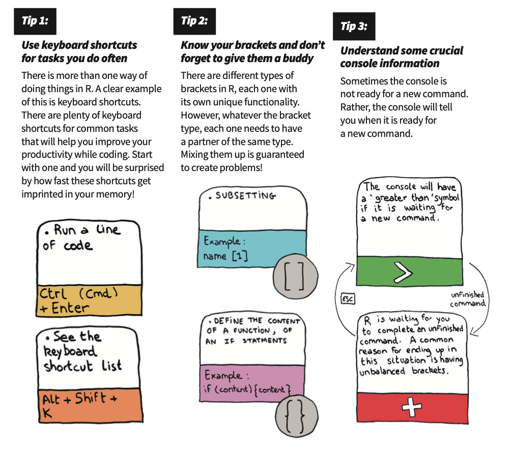

# Finding Resources

## Join the R community at the University of Melbourne

Subscribe to our mailing list to hear all about our upcoming events: conferences, workshops, meetups and more! 

\*\*\*\*[**Subscribe Now**](mailto:mdap-info@unimelb.edu.au?subject=MDAP%20Newsletter%3A%20Subscribe&body=Hi%20MDAP%2C%0A%0APlease%2C%20add%20me%20to%20the%20mailing%20list.%0A%0A)\*\*\*\*

## Resources at the University of Melbourne

* [Digital Skills Training](https://gateway.research.unimelb.edu.au/events/researcher-connect#digital-skills-training)
  * FREE R workshops, meetups and more!
* [Statistical Consulting Centre](https://scc.ms.unimelb.edu.au/)
  * [Statistics for Research Workers using R](https://scc.ms.unimelb.edu.au/statistics-courses/course-listing/srw-R)
  * [Introduction to R and Reproducible Research](https://scc.ms.unimelb.edu.au/statistics-courses/course-listing/research-and-r)
*  [Introduction to R for Social Scientists and Humanists](https://arts.unimelb.edu.au/research/digital-studio/news-and-events)
* [Library](http://unimelb.libguides.com/stat_software/R) \(See book recommendations!\)

If you are involved in \(or know of\) any other R-related events or communities at unimelb please shoot us an email at r.unimelb@gmail.com. We would love to hear about them!

## Online Community

* [Stack overflow](%20https://stackoverflow.com/questions/tagged/r)
* [R bloggers](www.r-bloggers.com)
* [Research Computing Services](https://research.unimelb.edu.au/infrastructure/research-computing-services) at the University of Melbourne.
* [R-Ladies Melbourne](https://twitter.com/RLadiesMelb)
* [COMBINE:](https://combine.org.au/) A student-run Australian organisation for students in computational biology, bioinformatics, and related fields. 

## Books

* [Introduction to R and RStudio](https://nikkirubinstein.gitbooks.io/resguides-introductory-r-workshop/content/content/01-rstudio-intro.html)
* [R for Data Science](https://r4ds.had.co.nz)
* [R-cookbook](%20http://cookbook-r.com)

## Cheatsheets

* [R Cheatsheets](https://rstudio.com/resources/cheatsheets/)
  * [Base R](http://github.com/rstudio/cheatsheets/raw/master/base-r.pdf)
  * [RStudio](https://github.com/rstudio/cheatsheets/raw/master/rstudio-ide.pdf)
  * [readr](https://github.com/rstudio/cheatsheets/raw/master/data-import.pdf)
  * [dplyr](https://github.com/rstudio/cheatsheets/raw/master/data-transformation.pdf)
  * [ggplot2](https://github.com/rstudio/cheatsheets/raw/master/data-visualization-2.1.pdf)
* [Useful Commands for data analysis](https://resbaz.github.io/R_intro_May/reference.html)

## Some Tips in R to Save you Time

## E-learning videos

#### Silly mistakes we all make in R/Rstudio



#### The joy of plotting in R



#### Don't code it, PIPE IT! Simplify R coding with one simple trick.



