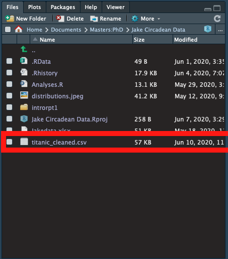

# Manipulating Data with dplyr

To manipulate data in the tidyverse, we go to the _dplyr_ package - a toolbox of different **"data pliers"** we can use to modify and manipulate our dataset. Just like _readr_, _dplyr_ also comes with a handy cheatsheet for data transformation you can find [here](https://github.com/rstudio/cheatsheets/raw/master/data-transformation.pdf). today we're going to cover 5 key functions that'll come in handy in your data transformation. these are `filter()`, `select()`, `mutate()`, `summarise()` and `group_by()`.  

But before we get onto that, let's talk about another key feature in the tidyverse that makes reading and writing code a breeze! Ladies and gentlemen, meet the **pipe** `%>%`.

### Piping your data

The pipe is a useful tool that simplifies writing code by allowing us to string together functions into a single **pipeline,** which can be executed all at once. Let's take another look at our cleaning code from the last chapter.

```r
> titanic_no_cabin <- select(titanic, -Cabin) 
> titanic_cleaned <- na.omit(titanic_no_cabin)
```

Here we have each command running by itself, and storing data into an intermediate variable called `titanic_no_cabin` in the middle. While this is perfectly fine,  if we do everything in a stepwise manner, we're quickly going to clog up our environment with a whole bunch of intermediate nonses we don't really want.

Another way to approach this would be to combine these into a single command, like this.

```r
> titanic_cleaned <- na.omit(select(titanic, -Cabin))
```

This works fine too, but it's easy to get confused as to what is going on, and changing code on the go can be a right pain. Instead, we can use the pipe to string functions together like this.

```r
> titanic_cleaned <- titanic %>% # we take the titanic dataset
    select(-Cabin) %>% # select the bits we want
    na.omit() # then remove the NAs
```

The pipe takes whatever the **output** from the function infront of it is, and uses it as the **input** for the next line down, giving us easy to follow and edit code. Rather than typing out the symbols `%>%`every time you want a pipe, you can use the shortcut `shift+command+M` on mac or `shift+control+M` on windows.

With pipes in had, let's go transform some data!

### filter\(\)

The first function we're going to have a look at is `filter()`, a useful function for selecting a **subset** of our data, based on whatever conditions we might want. Remember those comparisons we were using back in the first chapter? Now we can get a chance to use them!

Let's say I want to look at the subset of passengers aboard the Titanic who were 35 years of age. Using `filter()`, this is super easy to do! All we need to do is tell the filter function we want the "Age" variable to equal 35.

```r
> titanic35 <- titanic_cleaned %>% filter(Age == 35)
> glimpse(titanic35)
Observations: 18
Variables: 12
$ PassengerId <dbl> 4, 5, 21, 212, 231, 259, 270, 280, 364, 384, 487, 591
$ Survived    <dbl> 1, 0, 0, 1, 1, 1, 1, 1, 0, 1, 1, 0, 1, 0, 1, 1, 0, 0
$ Pclass      <dbl> 1, 3, 2, 2, 1, 1, 1, 3, 3, 1, 1, 3, 1, 3, 1, 1, 2, 3
$ Name        <chr> "Futrelle, Mrs. Jacques Heath (Lily May Peel)", "Alle
$ Sex         <chr> "female", "male", "male", "female", "female", "female
$ Age         <dbl> 35, 35, 35, 35, 35, 35, 35, 35, 35, 35, 35, 35, 35, 3
$ SibSp       <dbl> 1, 0, 0, 0, 1, 0, 0, 1, 0, 1, 1, 0, 0, 0, 0, 0, 0, 0
$ Parch       <dbl> 0, 0, 0, 0, 0, 0, 0, 1, 0, 0, 0, 0, 0, 0, 0, 0, 0, 0
$ Ticket      <chr> "113803", "373450", "239865", "F.C.C. 13528", "36973"
$ Fare        <dbl> 53.1000, 8.0500, 26.0000, 21.0000, 83.4750, 512.3292,
$ Embarked    <chr> "S", "S", "S", "S", "S", "C", "S", "S", "S", "S", "S"
```

In addition to our comparison operators `==`, `<=`, `>=`, `!=`, `<` and `>` , we can also combine these using the logical **and** `&` and **or** `|` operators to do stuff like:

 Find passengers who are 35 **or** 40...

```r
> titanic3540 <- titanic_cleaned %>% filter(Age == 35|Age == 40)
```

Find passengers who are **between** 35 and 40...

```r
> titanic35to40 <- titanic_cleaned %>% filter(Age >= 35 & Age <= 40)
```

Find female passangers from 1st class...

```r
> titanic1stfemales <- titanic_cleaned %>% filter(Pclass == 1 
    & Sex == "female")
```

Or female passangers from 1st class who survived the voyage...

```r
> titanic1stfemalessurvived <- titanic_cleaned %>% filter(Pclass == 1 
    & Sex == "female" & Survived == 1)
```

and the list goes on! Using `filter()`, you can slice up your dataset into whatever specific subsets you might want.

### select\(\)

Here's one we've already seen in action. While `filter()` works to subset our data on a **row by row** basis, `select()` let's us subset our data by **columns**. We can do this in a couple of ways, either by dropping variblaes we don't want by placing a minus "-" sign infront of them, like we did  while cleaning the dataset, or by specifying which columns we want to keep by name.

We can also combine this with filter to grab only the specific information we're interested in for our subsets. Say we want the names and fares of women in first class who survived for some reason. We can get that info like this.

```r
> names_fares <- titanic_cleaned %>% filter(Pclass == 1 
    & Sex == "female" & Survived == 1) %>%
    select(Name, Fare)
```

Note that the `select()` function needs to come **after** the `filter()` function, otherwise there wouldn't be anything for us to filter by!

### mutate\(\)

While `filter()` and `select()` are tools useful for _reducing_ our dataset, `mutate()` allows us to do the opposite and _generate_ new columns in our dataset. Say we want to have a representation of the fare variable adjusted for inflation to todays prices to give a better feel of the value of titanic tickets. A little poking around suggests that we'd need to multiply the fare values by roughly 82 to get an equivalent price. Using `mutate()` we can create a new variable called fareToday in our dataset with relative ease.

```r
> titanic_cleaned <- titanic_cleaned %>% 
    mutate(fareToday = Fare * 82)
```

Now that we've set up an equivalent price, let's have a look at how much these tickets were.

```r
> summary(titanic_cleaned$fareToday)
   Min. 1st Qu.  Median    Mean 3rd Qu.    Max. 
    0.0   660.1  1283.0  2834.5  2706.0 42011.0 
```

$42,011 is a damn lot for a ticket!

`mutate()`is also useful for creating new variables for us to filter or sort by. Say we're interested in separating out children and adults aboard the Titanic. We can use mutate to make a new logical variable stating whether a passenger was a child or adult using comparisions from our Age variable, like this.

```r
> titanic_cleaned <- titanic_cleaned %>%
    mutate(Child = Age < 18)
```

This is quite a powerful feature, especially when combined with our last two tools, `group_by()` and `summarise()`.

### group\_by\(\) and summarise\(\)

`group_by()` and `summarise()`are a pair of funcitons which work hand in hand to draw comparisons between, and answer questions about subsets of our dataset.

`summarise()`is a function that creates a new data frame of **summary statistics** from our entire dataset for one or more variables. To use it, we call the `summarise()` function, with names for our new columns, and whatever **summary functions** we want to use within it. These summary functions are things like:

* `mean()` to give us the mean value of a variable
* `sd()` to give us the standard deviation of a variable
* `min()` giving us the lowest value of a variable
* `max()` giving us the highest value of a variable
* `n()` giving us the number of observations in a variable

and many more.

Let's go ahead and generate some summary statistics about the ages of passengers on the Titanic.

```r
> ageSummary <- titanic_cleaned %>%
    summarise(meanAge = mean(Age), 
    sdAge = sd(Age),
    minAge = min(Age),
    maxAge = max(Age), 
    count = n()) 
> ageSummary 
# A tibble: 1 x 5
  meanAge sdAge minAge maxAge count
    <dbl> <dbl>  <dbl>  <dbl> <int>
1    29.6  14.5   0.42     80   712
```

Simple!

Where `summarise()` really gets powerful is when we combine it with `group_by()`to performa summaries on a **group by group** basis. Let's rerun those age summary staistics, but this time we're going to group by class beforehand.

```r
> ageClassSummary <- titanic_cleaned %>%
    group_by(Pclass) %>% # all we need to do is add a group by here...
    summarise(meanAge = mean(Age), 
    sdAge = sd(Age),
    minAge = min(Age),
    maxAge = max(Age), 
    count = n()) 
> ageClassSummary # ... in order to get a class by class summary here!
# A tibble: 3 x 6
  Pclass meanAge sdAge minAge maxAge count
   <dbl>   <dbl> <dbl>  <dbl>  <dbl> <int>
1      1    38.1  14.8   0.92     80   184
2      2    29.9  14.0   0.67     70   173
3      3    25.1  12.5   0.42     74   355
```

Now things are really getting interesting! We can see that passengers in 1st class were considerably older than those in 2nd and 3rd \(means = 38.1, 29.9, and 25.1 respectively\), and that there were far fewer 1st than 3rd class passengers \(184 vs 355\).

With `mutate()`, `group_by()` and `summarise()`, we can answer all kinds of questions about our dataset!

Were men or women more likely to survive?

```r
> titanic_cleaned %>%
    group_by(Sex) %>%
    summarise(meanSurvived = mean(Survived))
# A tibble: 2 x 2
  Sex    meanSurvived
  <chr>         <dbl>
1 female        0.753
2 male          0.205
```

Who paid more? Kids or adults?

```r
> titanic_cleaned %>%
    group_by(Child) %>%
    summarise(meanFare = mean(fareToday))
# A tibble: 2 x 2
  Child meanFare
  <lgl>    <dbl>
1 FALSE    2886.
2 TRUE     2560.
```

And by grouping by multiple variables we can dive deeper into understanding the dataset, such as understanding the boarding dynamics of different classes.

```r
> titanic_cleaned %>%
   group_by(Embarked, Pclass) %>% # you can group by 
   summarise(count = n()) # more than one variable...
# A tibble: 9 x 3
# Groups:   Embarked [3]
  Embarked Pclass count # ... and get all combinations in our summary!
  <chr>     <dbl> <int>
1 C             1    74
2 C             2    15
3 C             3    41
4 Q             1     2
5 Q             2     2
6 Q             3    24
7 S             1   108
8 S             2   156
9 S             3   290
```

He we can see that the majority of passengers \(especially those in 3rd class\) embarked at Southampton, with a bunch more first class passengers joining at Cherbourg, and very few hopping abourd at Queenstown.

### Saving your data

Having performed our analyese, the last hting we might want to do is save our data into a file somewhere. When manipulationg data in the _tidyverse_, the only plasce anything is changing is within RStudio itself, not in the underlying files we loaded the data from. 

Fortunately, it is easy to save data into a file ofr use by other programs , or to bring back into R at a later date.

Let's save our cleaned dataset into a new csv file named "titanic\_cleaned.csv\) using `write_csv()`. 

```r
> write_csv(titanic_cleaned, "titanic_cleaned.csv")
```

This will save a new csv file to your working directory, and should appear in your files panel looking a little like this.



With these tools under your belt, you're now ready to go tackle your own datasets and read, transform, export, and question to your heart's content. 

Go for it!

