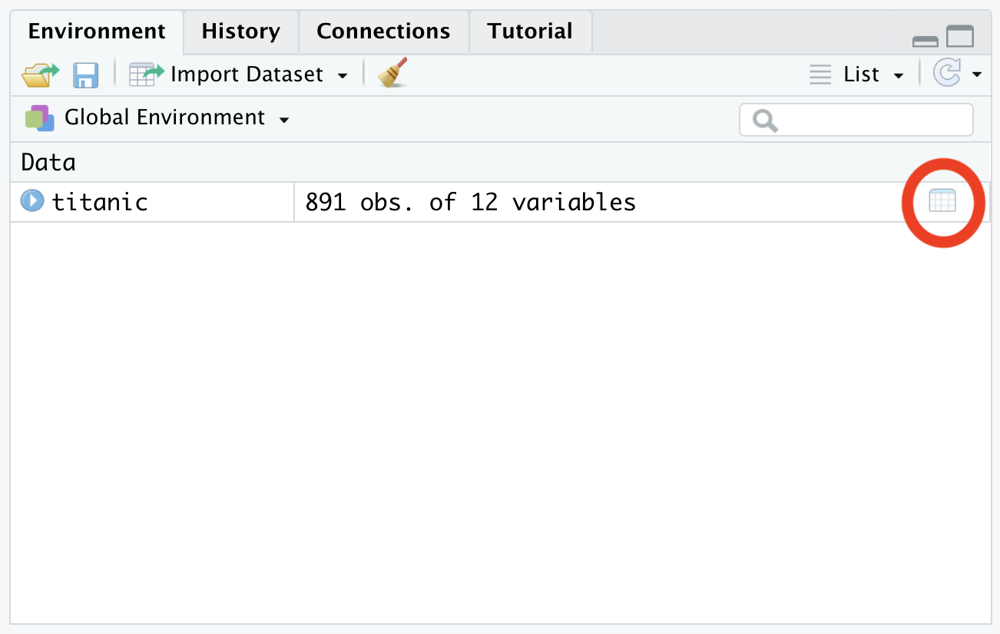

# Reading and Cleaning Data

### Reading data into RStudio

Before we can do any data manipulation or management, we need to get some data into R in the first place! 

The tidyverse package used to read data into R is, maybe unsurprisingly,  called _readr._  It contains several different functions used to read in different types of tabular data. You can read about these different functions in the _tidyr_ cheatsheet [here](https://rawgit.com/rstudio/cheatsheets/master/data-import.pdf) \(RStudio puts out many of these [helpful cheatsheets](https://rstudio.com/resources/cheatsheets/) as quick references for useful packages - I have a bunch printed out and stuck to the wall in my office, they're great!\).

Today, we are going to use the `read_csv()`function to read in a dataset \(in csv format\) containing information about passengers aboard the titanic. We can do this using the following code:

```r
> titanic = read_csv("https://goo.gl/4Gqsnz")
```

This line of code downloads a **comma separated value \(CSV\)** file containing our dataset from the web link [https://goo.gl/4Gqsnz](https://goo.gl/4Gqsnz), and loads it into a variable named titanic in our RStudio environment. Pretty neat huh?

Note that with this command you can also import files from your computer by specifying a filename instead of the url we used.

### Exploring our dataset

Now that we have our dataset ready to roll, let's take a look at it! There are a couple of different ways we can go about this.

One quick and easy way to check out a dataset is by using the `glimpse()` function.

```r
> glimpse(titanic)
Observations: 891
Variables: 12
$ PassengerId <dbl> 1, 2, 3, 4, 5, 6, 7, 8, 9, 10, 11, 12, 13, 14, 15, 16, 17, 18…
$ Survived    <dbl> 0, 1, 1, 1, 0, 0, 0, 0, 1, 1, 1, 1, 0, 0, 0, 1, 0, 1, 0, 1, 0…
$ Pclass      <dbl> 3, 1, 3, 1, 3, 3, 1, 3, 3, 2, 3, 1, 3, 3, 3, 2, 3, 2, 3, 3, 2…
$ Name        <chr> "Braund, Mr. Owen Harris", "Cumings, Mrs. John Bradley (Florc…
$ Sex         <chr> "male", "female", "female", "female", "male", "male", "male"…
$ Age         <dbl> 22, 38, 26, 35, 35, NA, 54, 2, 27, 14, 4, 58, 20, 39, 14, 55… 
$ SibSp       <dbl> 1, 1, 0, 1, 0, 0, 0, 3, 0, 1, 1, 0, 0, 1, 0, 0, 4, 0, 1, 0, 0…
$ Parch       <dbl> 0, 0, 0, 0, 0, 0, 0, 1, 2, 0, 1, 0, 0, 5, 0, 0, 1, 0, 0, 0, 0…
$ Ticket      <chr> "A/5 21171", "PC 17599", "STON/O2. 3101282", "113803", "37345…
$ Fare        <dbl> 7.2500, 71.2833, 7.9250, 53.1000, 8.0500, 8.4583, 51.8625, 21…
$ Cabin       <chr> NA, "C85", NA, "C123", NA, NA, "E46", NA, NA, NA, "G6", "C103…
$ Embarked    <chr> "S", "C", "S", "S", "S", "Q", "S", "S", "S", "C", "S", "S"…
```

`glimpse()` gives us a quick overview of what our dataset contains, including the number of observations \(rows\) in our dataset, the number of variables \(columns\) in our dataset, and the first few entries in each of those variables. To better understand the data, here are what each of these variables represent:

* PassengerId: Just an indexing number unique for each passenger.
* Survived: Whether or not the passenger survived. 0 = No, 1 = Yes. These are commonly used for binary outcomes, and if coerced into a logical would be `FALSE/TRUE`, respectively.
* Pclass: Ticket class: 1 = 1st Class, 2 = 2nd Class, 3 = 3rd Class.
* Name: A character string containing the name of each passenger.
* Sex: Character strings for passenger sex \(`"male"/ "female"`\) note that everything is in lower case, as R is **case-sensitive.**
* Age: Age in years.
* SibSp: The number of siblings/spouses aboard the titanic with the passenger
* Parch: The number of parents/children aboard the titanic with the passenger
* Ticket: Another character string containing the ticket ID of the passenger.
* Fare: The price paid for tickets in pounds Sterling \(multiply by 82 for a roughly equivalent price in 2020 AUD. Keep in mind that unskilled workers made around 1 pound a week,  these were _expensive_ tickets!\)
* Cabin: The cabin number of the passengers \(character\).
* Embarked: Where passengers boarded the titanic. C = Cherbourg, Q = Queenstown, S = Southampton\).

Another useful command for having a quick look at a dataset is the `summary()` function, which can provide some quick summary statistics for our variables.

```r
> summary(titanic)
  PassengerId       Survived          Pclass          Name               Sex                 Age            SibSp      
 Min.   :  1.0   Min.   :0.0000   Min.   :1.000   Length:891         Length:891         Min.   : 0.42   Min.   :0.000  
 1st Qu.:223.5   1st Qu.:0.0000   1st Qu.:2.000   Class :character   Class :character   1st Qu.:20.12   1st Qu.:0.000  
 Median :446.0   Median :0.0000   Median :3.000   Mode  :character   Mode  :character   Median :28.00   Median :0.000  
 Mean   :446.0   Mean   :0.3838   Mean   :2.309                                         Mean   :29.70   Mean   :0.523  
 3rd Qu.:668.5   3rd Qu.:1.0000   3rd Qu.:3.000                                         3rd Qu.:38.00   3rd Qu.:1.000  
 Max.   :891.0   Max.   :1.0000   Max.   :3.000                                         Max.   :80.00   Max.   :8.000  
                                                                                        NA's   :177                    
     Parch           Ticket               Fare           Cabin             Embarked        
 Min.   :0.0000   Length:891         Min.   :  0.00   Length:891         Length:891        
 1st Qu.:0.0000   Class :character   1st Qu.:  7.91   Class :character   Class :character  
 Median :0.0000   Mode  :character   Median : 14.45   Mode  :character   Mode  :character  
 Mean   :0.3816                      Mean   : 32.20                                        
 3rd Qu.:0.0000                      3rd Qu.: 31.00                                        
 Max.   :6.0000                      Max.   :512.33
```

Lastly, if we want to explore the whole dataset, we can access RStudio's inbuilt data viewer by clicking the table icon next to our dataset in the environment panel or by using the `View()` function.



### Cleaning our dataset

Now that we have our data in our RStudio environment, the next thing we need to do is **clean** it! Cleaning data refers to the process of removing errors or missing values from the dataset, and is a crucial step in data analysis - _how can we trust the results of an analysis if the data going into it isn't up to scratch?_ 

Looking at the `glimpse()` from before, we can see quite a few missing values in our dataset. In R, these missing values are represented by an `NA` tag. Removing or resolving these **NA's** is an important part of cleaning our data, as many functions in R won't know what to do when they encounter such values.

Let's have a look at which variables contain these missing values. To do this, we're going to combine 2 functions:

*  `is.na()` returns a logical `TRUE/FALSE` value whenever it finds a missing value.
* `colSums()` sums up all the values in each column of our dataframe. 

Let's go ahead and see where those NAs are located.

```r
> colSums(is.na(titanic))
PassengerId    Survived      Pclass        Name         Sex         Age       SibSp       Parch      Ticket        Fare 
          0           0           0           0           0         177           0           0           0           0 
      Cabin    Embarked 
        687           2 
```

Here we can see we have 177 missing values in our `Age` column, 2 missing values in our `Embarked` column, and a whopping 687 missing values in our `Cabin` number column. Given that our dataset contains 891 observations in total, this is a huge fraction! 

The most straightforward way to deal with missing values is to delete the observations \(rows\) that contain them from our dataset, but doing so in this case would leave us very little data to work with. Instead, let's first remove the entire `Cabin` variable from our dataset given that we won't be using this variable for our analysis. 

In order to remove the column we are going to use a function from the tidyverse \(dplyr\): `select()`.

```r
# We create a new clean titanic dataset, 
# and select everything MINUS the cabin variable
> titanic_no_cabin <- select(titanic, -Cabin) 
```

We now remove the entries with missing values using the `na.omit()` function. That might look a little like this:

```r
# we create a new clean titanic dataset, 
# then we remove the NA's
> titanic_cleaned <- na.omit(titanic_no_cabin)

# and we're left with a dataset free from NA's!
> colSums(is.na(titanic_cleaned))
PassengerId    Survived      Pclass        Name         Sex         Age       SibSp       Parch      Ticket        Fare 
          0           0           0           0           0           0           0           0           0           0 
      Cabin    Embarked 
          0           0 
```

Of course, depending on your specific data your cleaning needs may look a little different to this, but for now, this dataset is ready to go!

### Challenges

Now that we've imported and cleaned our data,  here is a challenge to test what you've learned.

#### Challenge 1



```r
1. How many observations (rows) are now in the clean data set?
2. How many variables (columns) are now in the clean data set?
```



```r
# You can answer both questions by typing: 
> glimpse(titanic_cleaned)

# You can also find the answer with the following commands:
# 1.
> nrow(titanic_cleaned)
[1] 712
# 2.
> ncol(titanic_cleaned)
[1] 11
```



#### Challenge 2



```r
1. Is there commmands to import .tsv files? 
2. How can you import excel files?

HINT: Look at the tidyr/readr cheatsheet.
```



```r
# 1.
> df <- read_tsv("file_name")

# 2. Use the "readxl" package 
```



